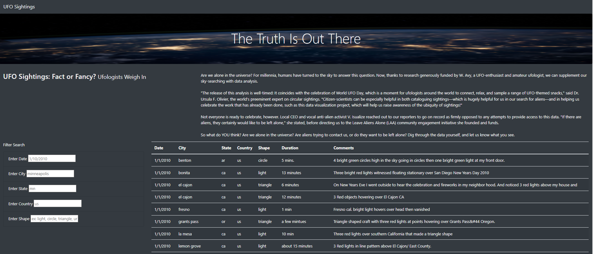

# UFOs

## Project Overview
The purpose of this project is to create an HTML webpage that provides a dynamically-changing table of UFO sighting instances.  The primary code language utilized is Javascript as well as minor code snippets of CSS, and within the webpage, the user can utilize the 5 unique filter fields to return more precise results on the UFO data table, as well as refresh the results back to the default master table view instantly.

### Results
The webpage provides a clean user interface with some nice imagery and attractive color-coded text, with a bit of contextual background on UFO sightings, their significance and past controversy that has surrounded the topic.

The user can utilize the dynamic table to view a summary of all UFO sightings across January 2010, providing the date of the instance, the location (city, state, country), the UFO shape, duration of the instance and any additional accompanying commentary.

In addition, there are 5 filter fields for the user to trim down the table results further, as the default view returns quite a few rows resulting in page scrolling.  The 5 page filters are the following:
  - Date of the instance
  - City where the instance occured
  - State where the instance occured
  - Country where the instance occured
  - Shape of the UFO 

The user can choose to utilize one filter, or can simultaneously enter in keywords on multiple filters to continue trimming the table resuls down.  They can also clear out any filters and expand the table further, ultimately back to it's default view if no filters have keywords provided.

### Summary
#### Drawbacks
One drawback of using Javascript language is that it is extremely case-sensitive, in that even improperly entering a single upper or lowercase value may impact the search results.  For example, if you key in the city of "Benton" instead of "benton", no results will be returned.  And vice versa, a table result will be returned if the city name does not start with a capital letter. 

#### Recommendations
Currently, it's not easy to return multiple unique results of a city, state, date, etc., but rather it is static to only pull back a single keyworld result per filter field.  For example, maybe we want to see all UFO sightings across a few states (ca, mo, ky) instead of just one (ca).  A feature that could accomplish this is introducing a dropdown menu or clickable filters instead of typing in a single keyword to a blank cell, or providing a feature within the keyword cell where a comma seperator between keywords indicates multiple to be returned in a single search queue.

While this dataset also ins't tremendously long, we may see more UFO instances come in over time and add to this data set.  In the future, we may want to see search results quantified instead of manually counting every row in the table.  To do this, one recommendation may be to write in to the HTML code for a field to be added that counts the amount of results returned by a search field (ex: when typing in the state keyword of "az" another position on the home page pops up a dialog box that says "Your search returned 2 results.").